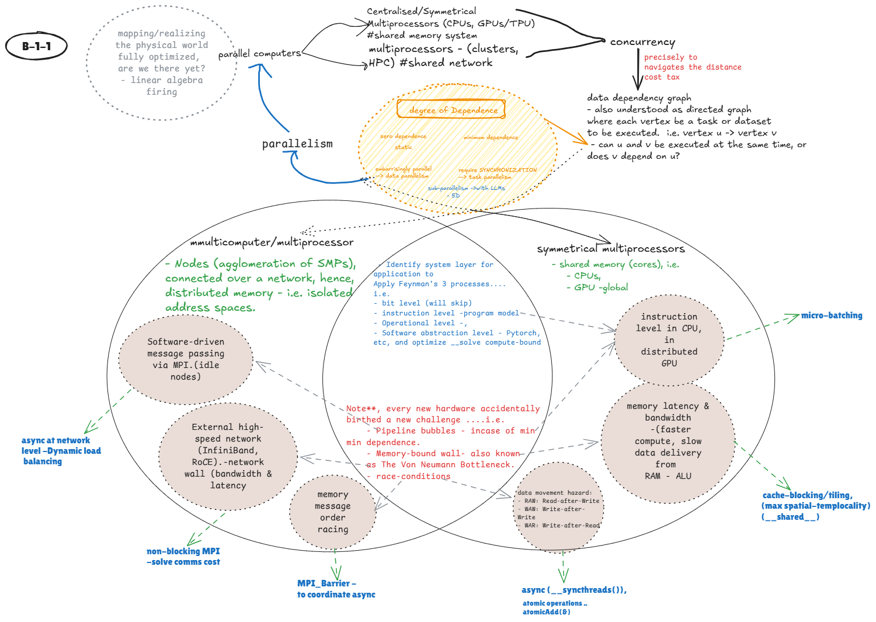

This project goal is reconstructing knowledge continuity for high performance scientific computing through:
- map an algorithm's dependence structure
- identify its dwarf class and data type 
- outline its bottleneck
- measure its roofline position
- carry that reasoning upward into LLM execution, training, and finetuning

The central line is simple:

> The dependence graph is the dwarf. Fix the dependence structure of an algorithm and you have already determined its available parallelism, arithmetic intensity, roofline position, and the system level it belongs on.

# Identifying the dwarf 
The Berkeley View created over 20 years ago, summarizes data movement and the computational bottlenecks through 13 dwarfs. All these dwarf reintroduce the mathematical foundations unto which all the algorithms and all the current computer architecture and software sit, i.e. sparse Matrices, Dense Matrices, the ..... The dwarfing goal was to highlight the bottlenecks faced with the current computing world with some structure. 

Our project is exploiting only 3 of the 12 in the effort to reproduce in an indexed manner, not only their genesis, but how they've influenced high performance computing and innovation for over a century. These include; 
- STREAM TRIAD (C = A + B*scalar; one of the simplest sum-product vector updates)
- Sparse Matrix Vector (y = Ax; where A is a sparse vector)
- General Matrix Multiply (C = xAB + nC; a grid product-sum update)
- Fast Fourier Transform -FFT (.........; BONUS: as is one of the complex application for the engine)
- Combinatorial Logic (TBD)

# Snapshot of computing infrastructure for the last 20 years - including bottlenecks

## Evolutionary snapshot

| Era | Core Problem | Mathematical Models Executed | Hardware Solution | Programming Model / Software Layer | New Problem / Next Bottleneck | Evolutionary Architecture Notes |
|---|---|---|---|---|---|---|
| 7. The Memory Wall & Synchronization Stall (Late 1990s–2004) | Cores drop performance while waiting for lock variables across a unified bus. | Parallel PDE solvers and finite element analysis: splitting complex global physics equations across distributed cluster threads. | NUMA architecture: breaking system RAM into local banks per core socket while using a shared L3 cache as a buffer. | Hybrid software stack: MPI for macro-cluster networking, OpenMP for micro multi-core threads, and BLAS for low-level math. | The Death of Dennard Scaling (2004): microscopic transistors leak electricity, and clock speeds hit a thermal frequency wall at about 4.0 GHz. | Analyze how early scientific subprograms maximized throughput using the Netlib Repository BLAS standard. |
| 8. The Thermal Frequency Wall (2004–Present) | NUMA CPUs cannot grow faster because latency-focused control logic generates too much heat. | Deep learning tensor mathematics: massively parallel multi-dimensional matrix dot products and backpropagation algorithms. | General-purpose GPUs (GPGPUs): stripping away complex caches and control logic to pack thousands of tiny math ALUs onto one chip. | Massively parallel software (2006): NVIDIA launches CUDA, allowing standard C++ to launch parallel math kernels on GPUs. | The GPU global memory hierarchy wall: fast internal math processing units sit idle waiting for off-chip high-bandwidth memory (HBM). | Explore the modern hardware parameters of the massive computing cluster systems built for the NVIDIA Blackwell platform. |

## The cross-error matrix problem

| Historical Ancestor Problem | Modern Reincarnation (The Echo) | Common Structural Mechanism | How the Modern Era Solved It |
|---|---|---|---|
| Feynman's Human Routing Bottleneck (Era 1) | The Inter-GPU Networking Bottleneck (Era 8) | Physical transit latency: the processing core, whether human or GPU ALU, is significantly faster than the pathway used to deliver the data. | NVIDIA NVLink switch fabric: creating a hardwired, high-speed routing highway that unifies 72 GPUs into a single logical pool. |
| The Von Neumann Bottleneck (Era 2) | The GPU Global Memory Wall (Era 8) | The memory wall: arithmetic capabilities scale exponentially faster than the physical bus speeds connecting logic to memory storage. | High-bandwidth memory (HBM3e) and CUDA Unified Memory: stacking memory layers vertically on the chip and automating background data transfers in software. |
| The Loop Control Instruction Overhead (Era 3) | The Latency-Optimized CPU Core Inefficiency (Era 7) | Control logic bloat: designing chips to intelligently handle chaotic, single-file code sequences wastes the physical real estate needed for bulk parallel mathematics. | GPGPU / SIMD architecture: stripping away branch predictors and packing the silicon with simple, dense rows of raw calculators (ALUs). |
| The Grid Geometry & Masking Loophole (Era 5) | The Sparse Matrix & AI Token Padding Inefficiency (Era 8) | The rigid data shape mismatch: physical computing grids are hardwired to process symmetrical, binary blocks, while real-world mathematics is highly irregular and asymmetric. | Tensor Cores and sparsity software engines: building dedicated, hardware-accelerated sparsity circuits directly into silicon to skip zero-value math entirely. |

## Software and applications

| Era | Core Problem | Mathematical Models / Workloads | Hardware Solution | Programming Model / Software Layer | New Problem / Next Bottleneck |
|---|---|---|---|---|---|
| 9. The CUDA Complexity Crisis (2015) | Scientists waste months manually managing GPU thread dimensions and synchronization. | Static computational grids: deep convolutional networks and fixed-length recurrent neural networks (RNNs). | NVIDIA Kepler / Maxwell architectures: standard discrete GPUs processing bulk data arrays. | Static-graph frameworks (TensorFlow 2015): compiling a rigid mathematical blueprint ahead of time to abstract away raw CUDA. | The debugging and rigidity wall: inability to handle dynamic, variable-length natural language processing sequences easily. |
| 10. The Dynamic Sequence Challenge (2016–2020) | Natural language text sequences vary wildly in length, breaking static hardware graphs. | Dynamic attention tensors: transformers, variable-length text generation, and backpropagation tracking. | NVIDIA Pascal / Volta (early Tensor Cores): silicon designed specifically to accelerate 4x4 matrix-multiply operations. | Dynamic-graph frameworks (PyTorch 2016): imperative, line-by-line execution that intercepts math and drops it straight into optimized CUDA streams. | The GPU global memory hierarchy wall: the GPU ALUs calculate math so fast that they sit starved waiting for data from off-chip VRAM. |

# Microbenchmarking and roofline based on each dwarf algorithm 

## First, CUDA --> Python Frameworks

| Transition | Description |
|---|---|
| The Transition from Raw Binary to Assemblers (Era 2) | Kathleen Booth and Grace Hopper wrote the first assemblers because writing raw binary numbers such as 0001 1100 was too error-prone for humans. |
| The Transition from Raw CUDA to PyTorch/TensorFlow (Era 9/10) | Scientists invented PyTorch because manually managing thousands of physical GPU threads and VRAM pointers was too slow and complex. |
| The Abstraction Leap | Whenever hardware introduces a massive jump in raw capability, humans initially try to program it manually before realizing they must invent a software abstraction layer to preserve human sanity. |
| PyTorch Tensors & Operators | Wrapping complex C++/CUDA execution scripts inside simple Python syntax such as outputs = model(inputs). |

Phase 0 of this project is expressed in CUDA/C++, with an effort to exploit all CUDA capabilities to expose all compute and memory interactions through the entire benchmarking process. In the end, the phase will highlight how each of the dwarf algorithms negotiates and displays each one of the bottlenecks highlighted in the image:

Python and advanced frameworks will be adopted for visualisations and along the way in the effort to accomplish the LLM development progression. 

## Bottleneck per mathematical model
The image above maps and summarizes the bottlenecks as would be exposed by each mathematical model.i.e.

### STREAM TRIAD
**Full Math function** 
**Why this model?** The STREAM triad was the first benchmarking algorithm created by John in 1994 arguing the ceiling of the manycore and manythreads architectural developments at the time.  It is the minimal product-sum update and therefore the cleanest expression of streaming memory traffic. 

**What it exposes?** It exposes the memory wall directly. The kernel highlights whether the system is limited by bandwidth, latency, or the ability to sustain a long sequence of regular loads and stores.

**Results expected:** Memory-bandwidth bottleneck and streaming throughput ceiling.

### SpMV Matrix
**Full Math function** 
**Why this model?**
**What it exposes?**
**Results expected:** 

### GEMM Matrix
**Full Math function** 
**Why this model?**
**What it exposes?**
**Results expected:** 

### FFT
**Full Math function** 
**Why this model?**
**What it exposes?**
**Results expected:** 

# Results analysis
