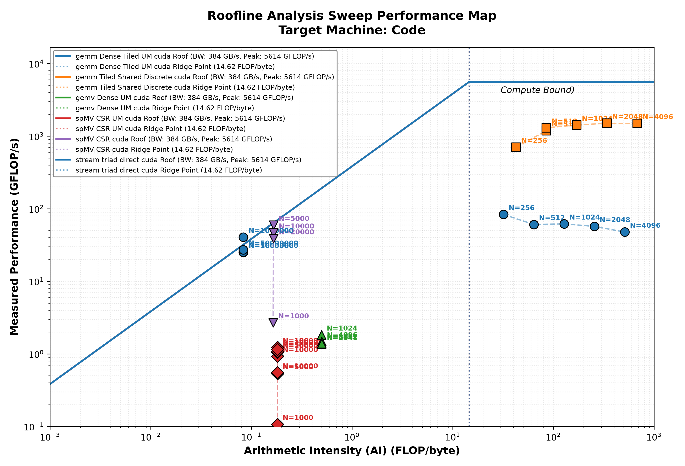

## Phase 0: Benchmarking and Roofline Exploration for CPU/GPU Data Movement

This repository explores system (GPU) performance mapping and optimization using both baseline and advanced benchmarking and roofline frameworks.

### What this repository explores
The work in this folder focuses on connecting two scientific-computing questions to industry practice and innovation:

1. How does data movement limit performance across different machine architectures?
2. How do dependence structure and data layout change the balance between compute and memory pressure?

The emphasis is on latency, understanding architectural behavior and bottlenecks, and how they are navigated through baseline and advanced roofline and benchmarking. Read the blog for extended notes.

- Baseline benchmarking — identifying the compute vs. memory-bound dependency.
- Advanced benchmarking — optimizing each dependency graph/data movement structure to maximize compute and memory benefits.

### Approaches explored include
- Language & compiler: custom `CUDA/C++` kernel writing (`nvcc` executions)
- `Python` for analysis
- `C++` for low-level benchmark implementations (CMake builds)
- GPU roofline mapping by the dependence graphs

| Column 1 | Baseline Roofline | Advanced benchmarking |
| -------- | ----------------- | --------------------- |
| `spMV` | Memory bandwidth & uncoalesced access | Flag divergence and non-contiguous memory requests |
| `GEMM` | Tensor core | Show mixed-precision execution and hierarchical cache-line hits |
| `GEMV` | Dynamic workloads & divergence | Measure runtime load imbalance and thread scheduling stalls |
| `STREAM TRIAD` | Peak memory bandwidth | Set the ultimate saturation baseline for raw memory throughput |
| `FFT` | Complex communication & memory strides | Expose shared memory bank conflicts and global memory stride penalties |

> **Note:** these five kernels cover the dominant compute/memory patterns in NN and transformer workloads.

### Repository structure
- `cpp/` — baseline benchmark and kernel source files
- `cpp_ad/` — advanced benchmark and kernel source files
- `python/` — analysis and plotting scripts
- `build/` — generated build outputs and local CMake artifacts
- `roofline.csv` — measurement snapshots used for roofline-style analysis
- `roofline_chart.png` — generated visualization

## Public access and cloning

This repository is public and can be cloned directly with:

```bash
git clone https://github.com/StellaWava/benchmarking-n-profiling-.git
cd benchmarking-n-profiling-
```
### Getting started

A standard workflow for using the repository is:
1. Clone the repository.
2. Inspect the benchmark sources in `cpp/` or `cpp_ad/`.
3. Build and compile with CMake/Ninja/nvcc and reproduce `roofline.csv`.
4. Use the Python analysis scripts to plot and interpret the results.

### Baseline results and analysis
The resulting roofline-style plot illustrates how each kernel compares against the hardware’s peak-performance ceiling and highlights where bottlenecks emerge. See results


Conclusion from the baseline roofline plot:
- GEMM is compute-bound, while the rest are memory-bound.
- Unified memory access is significantly more efficient than discrete memory access.
- STREAM triad is the most memory-bound algorithm.

### Reference
Samuel Williams, Andrew Waterman, and David Patterson. 2009. Roofline: an insightful visual performance model for multicore architectures. Commun. ACM 52, 4 (April 2009), 65–76. https://doi.org/10.1145/1498765.1498785

### Advanced results and analysis
**Note:** This is a working repository updated often. Ensure to update it often if you fork it.

### Motivation
The overall goal is to highlight the research and engineering efforts made so far toward overcoming bottlenecks encountered as a result of the nature of data movement through modern machines and how it shapes performance across scientific computing kernels.

This phase zero is a snapshot of the parallel systems blogging exercise on redefining knowledge convergence through a new research question: [What is the cost of distance](https://www.stelladataarc.com/parallel-systems.html)?

I am creating phases along **Architecture → Benchmarking → LLM/Language Model Dev & Training → Runtime & Inferencing → Fine-tuning**

